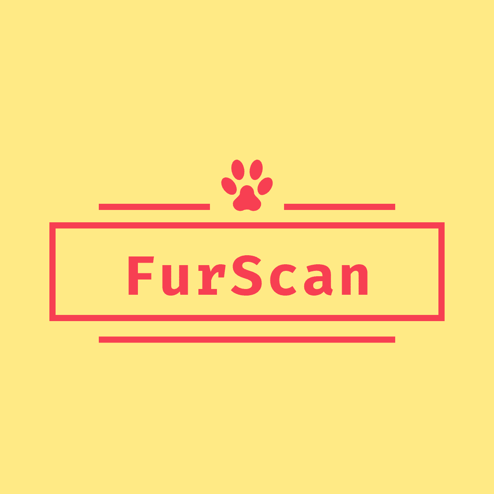
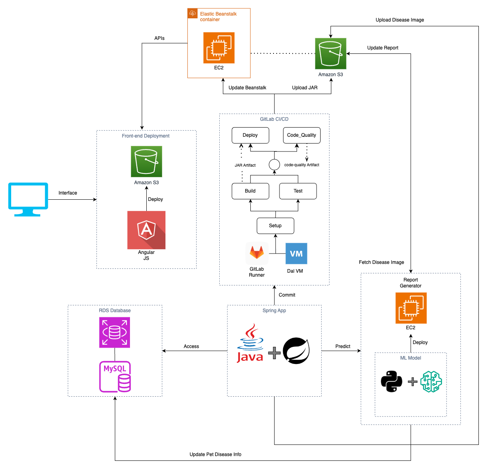
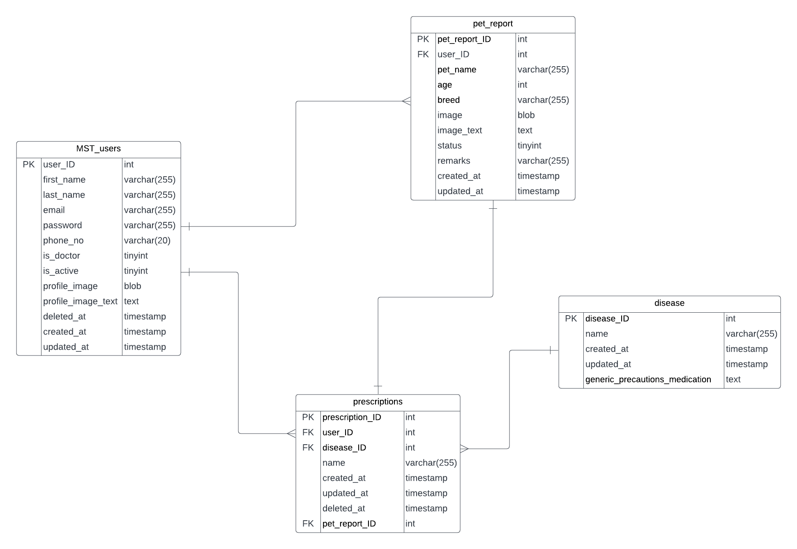
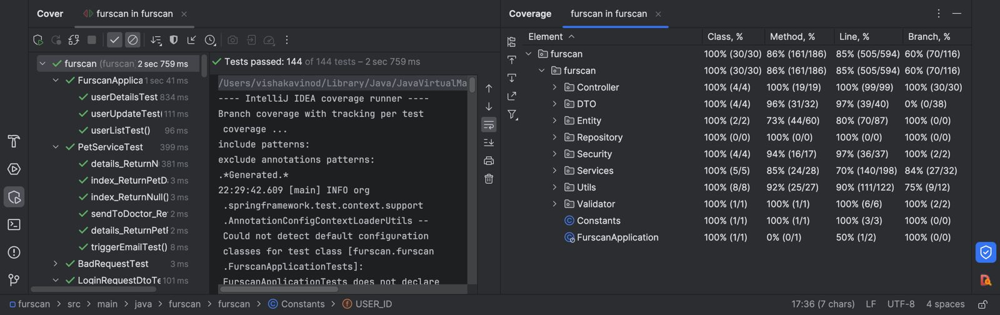

# FurScan
{width=100 height=100px}

Empowering pet owners with advanced health insights. Our mission is to provide compassionate care for your beloved animals. Discover peace of mind through early disease detection and tailored wellness plans. Join us in nurturing a healthier, happier life for your furry companions.

## Table of contents
<!--ts-->
- [Overview](#overview)
- [Features](#features)
- [App Development Flow](#app-development-flow)
- [ER Digram](#er-diagram)
- [Dependencies and Installation](#dependencies-and-installation)
- [Build and Deployment](#build-and-deployment)
- [Usage Scenarios](#usage-scenario)
- [CI/CD](#cicd)
- [Tests](#tests)
- [Code Quality](#code-quality)
- [Contributors](#contributors)
<!--te-->

## Overview

Discover the powerful capabilities that FurScan brings to the world of canine dermatology. Our carefully curated set of features is designed to streamline the process of identifying and addressing skin issues in your furry companions. From cutting-edge AI analysis to expert vet verification, FurScan is your trusted partner in ensuring the well-being of your beloved dogs.
App link - http://furscan-app.s3-website-us-east-1.amazonaws.com/

## Features

- **AI-Powered Diagnosis:** Leverage advanced artificial intelligence to swiftly identify a wide range of skin conditions, providing you with initial insights within minutes.

- **Vet Verification:** Rest easy knowing that our team of experienced veterinarians meticulously reviews every diagnosis, ensuring accuracy and reliability.

- **Detailed Reports:** Receive comprehensive reports that not only outline the identified issue but also offer potential causes and recommended next steps for your dog's skin health.

- **Secure User Accounts:** Create personalized accounts to keep track of your furry companions' cases, ensuring a seamless and tailored experience.

- **Multi-Pet Support:** Extend the platform to cater to owners who have multiple dogs, allowing them to manage and track the health of each pet.

- **Case History Management:** Allow users to easily access and manage the history of their dog's skin condition cases, including previous diagnoses, treatments, and progress.

## App Development Flow
{width=800 height=700px}

## ER Diagram
{width=700 height=500px}

## Dependencies and Installation

### Backend
- Apache-Maven: 3.9.5
- JDK: 17

#### Spring Boot with Apache Maven and JDK 17

- Install Apache Maven 3.9.5 and JDK 17.
  - For Linux:

    ```bash
    # Install Apache Maven
    sudo apt install maven

    # Install OpenJDK 17
    sudo apt install openjdk-17-jdk
    ```

  - For installing Maven through tar.gz
    ```bash
    # Download Maven
    wget https://dlcdn.apache.org/maven/maven-3/3.9.5/binaries/apache-maven-3.9.5-bin.tar.gz

    # Extract the downloaded file
    tar -xvf apache-maven-3.9.5-bin.tar.gz

    # Move Maven to the /opt/ directory
    sudo mv apache-maven-3.9.5 /opt/

    # Set environment variables
    M2_HOME='/opt/apache-maven-3.9.5'
    PATH="$M2_HOME/bin:$PATH"
    export PATH

    # Verify Maven installation
    mvn -version
    ```

  - For Windows:
    - Download Apache Maven 3.9.5 from [here](https://maven.apache.org/download.cgi) and follow the installation instructions.
    - Download JDK 17 from [here](https://www.oracle.com/java/technologies/javase/jdk17-archive-downloads.html) and follow the installation instructions.

### Frontend
- Angular CLI: 17.0.3
- Node: 21.2.0
- Package Manager: npm 10.2.3


#### Angular with Angular CLI, Node, and npm

- Install Node.js 21.2.0 and npm 10.2.3.
  - For Linux:
    ```bash
    # Install Node.js and npm
    sudo apt install nodejs
    sudo apt install npm
    ```

  - For Windows:
    - Download Node.js 21.2.0 from [here](https://nodejs.org/en/download/) and follow the installation instructions.
    - npm is included with Node.js.

- Install Angular CLI 17.0.3 globally:
  ```bash
  npm install -g @angular/cli@17.0.3
  ```

## Build and Deployment

### Backend

#### Build with Maven

Run the following commands to build the Spring Boot JAR:

```bash
cd furscan_spring_boot_api/furscan
M2_HOME='/opt/apache-maven-3.9.5'
PATH="$M2_HOME/bin:$PATH"
export PATH
mvn clean package
```
This will create a JAR file in the target/ directory.

To run the app on localhost:

```bash
mvn spring-boot:run
```

#### Deploy Backend to AWS Beanstalk
##### Python Installation
Windows:
- Visit the [official Python website](https://www.python.org/downloads/).
- Download the latest version of Python for Windows.
- Run the installer.
- Check the box that says "Add Python to PATH" during installation.
- Click "Install Now" to start the installation.

Linux:

Python is pre-installed on many Linux distributions. You can check the version by running:

```bash
python --version
```

If Python is not installed, you can install it using the package manager for your distribution:

```bash
sudo apt update
sudo apt install python3
sudo apt install -y python3-pip 
```

Refer to this [guide](https://medium.com/javarevisited/deploy-spring-boot-app-to-aws-elastic-beanstalk-fa42b8b4bfa0) for detailed instructions on deploying a Spring Boot app to AWS Elastic Beanstalk.

Beanstalk platform needed- Corretto 17 running on 64bit Amazon Linux 2/3.6.1 


Ensure AWS CLI is installed, and configure it:
- Click [here](https://docs.aws.amazon.com/cli/latest/userguide/getting-started-install.html) to install AWS CLI

Create a new Access Key and Secret Key pair:
- Sign in to the AWS Management Console
- Navigate to IAM (Identity and Access Management):
- Open the "Services" dropdown.
- Under "Security, Identity, & Compliance," select "IAM."
- In the left navigation pane, choose "Users."
- Select the user for whom you want to create access keys or create a [new User](https://docs.aws.amazon.com/IAM/latest/UserGuide/id_users_create.html).
- In the "User details" page, go to the "Security credentials" tab.
- Under the "Access keys" section, choose "Create access key."
- Choose "Download .csv file" to download the access key and secret key pair.

Replace the Acces Key, Secret Key and the default region in the below commands
```bash
aws configure set aws_access_key_id $AWS_ACCESS_KEY_ID
aws configure set aws_secret_access_key $AWS_SECRET_ACCESS_KEY
aws configure set region $AWS_DEFAULT_REGION
```
Run the following commands to deploy the JAR to AWS Beanstalk:

```bash
aws s3 cp furscan_spring_boot_api/furscan/target/${JAR_FILE_NAME} s3://$S3_BUCKET/${JAR_FILE_NAME}
aws elasticbeanstalk create-application-version --application-name $APPLICATION_NAME --version-label $VERSION --source-bundle S3Bucket="$S3_BUCKET",S3Key="${JAR_FILE_NAME}"
aws elasticbeanstalk update-environment --application-name $APPLICATION_NAME --environment-name $ENVIRONMENT_NAME --version-label $VERSION
```

Replace the variables with your specific values:

- ${JAR_FILE_NAME}: The name of your JAR file.
- $VERSION: Version number of the updated app
- $S3_BUCKET: The name of your S3 bucket.
- $APPLICATION_NAME: The name of your Beanstalk application.
- $ENVIRONMENT_NAME: The name of your Beanstalk environment.

### Frontend

Change the base url apiPrefix in Fur_Scan/src/app/apis.service.ts if creating a new Beanstalk app for the Spring Boot backend otherwise keep the file as it is becase the APIs are already hosted.
```javascript
import { Injectable } from '@angular/core';

@Injectable({
  providedIn: 'root'
})
export class ApisService {
  apiPrefix: string = 'http://your-beanstalk-app-url/';
  baseUrl: string = 'http://52.23.167.187/predict/';

  constructor() {
    // You can leave the constructor empty or include additional setup logic if needed.
  }
}
```

Run the following commands to build the Angular app:

```bash
cd Fur_Scan
```
We need to install some dependencies to run and build our Frontend. The dependencies are available inside FurScan/package.json

```json
"dependencies": {
    "@angular/animations": "^16.1.0",
    "@angular/cdk": "^16.2.6",
    "@angular/common": "^16.1.0",
    "@angular/compiler": "^16.1.0",
    "@angular/core": "^16.1.0",
    "@angular/forms": "^16.1.0",
    "@angular/material": "^16.2.6",
    "@angular/platform-browser": "^16.1.0",
    "@angular/platform-browser-dynamic": "^16.1.0",
    "@angular/router": "^16.1.0",
    "@ng-bootstrap/ng-bootstrap": "^15.1.1",
    "@popperjs/core": "^2.11.6",
    "bootstrap": "^5.2.3",
    "cors": "^2.8.5",
    "rxjs": "~7.8.0",
    "tslib": "^2.3.0",
    "zone.js": "~0.13.0"
  }
```

Run the below command:

```bash
npm install
```

To run on localhost:4200 - 
```bash
ng serve
``` 

The below command will create a dist/fur-scan directory with your compiled Angular app.
```bash
ng build 
```


Currently the App is running on S3 and accessible over the link - http://furscan-app.s3-website-us-east-1.amazonaws.com/


#### Deploy Frontend to AWS S3
Create an S3 Bucket:
- Open the [AWS Management Console](https://aws.amazon.com/console/).
- Navigate to the S3 service.
- Click on the "Create bucket" button.
- Enter a unique bucket name and choose a region.
- Click through the configuration options and create the bucket.

Upload the contents of the dist/ directory to your S3 bucket using the AWS CLI or the AWS Management Console.

AWS CLI Command:

```bash
aws s3 sync dist/fur-scan/ s3://your-bucket-name/
```

Set Up CORS Configuration:
- In the S3 Management Console, select your bucket.
- Navigate to the "Permissions" tab.
- Scroll down to find the "Cross-origin resource sharing (CORS)" configuration.
- Add the following CORS rules to allow requests from any origin (*).
```yaml
[
    {
        "AllowedHeaders": ["*"],
        "AllowedMethods": ["GET", "HEAD", "PUT", "POST", "DELETE"],
        "AllowedOrigins": ["*"],
        "ExposeHeaders": []
    }
]
```
Update the Bucket Policy:
- In the S3 Management Console, select your bucket.
- Navigate to the "Permissions" tab.
- Scroll down to find the "Bucket Policy" configuration.
- Add the following policy.

```yaml
{
    "Version": "2012-10-17",
    "Statement": [
        {
            "Effect": "Allow",
            "Principal": "*",
            "Action": "s3:GetObject",
            "Resource": "arn:aws:s3:::{your-bucket-name}/*"
        }
    ]
}
``` 
Enable Static Website Hosting:
- In the S3 Management Console, navigate to the "Properties" tab.
- Find the "Static website hosting" card.
- Choose "Use this bucket to host a website."
- Static website hosting: Enabled
- Hosting type: Bucket hosting
- Enter index.html as the Index document.
- Enter index.html as the Error document.

Access the Website URL:
- After saving the static website hosting configuration, you'll get an endpoint URL. This is the URL where your Angular app will be accessible.
- Access your Angular app through the provided endpoint URL.

## Usage scenario
- Home page
  - Features
  - FAQs
  - About us
  - Contact
- Authentication
  - Login
  - Register
  - Forgot Password
- User Dashboard
- User Profile page
- Image Upload page
- Result page
- Prediction of Skin disease
  - ML Prediction
  - Auto report generation
- Email Notification
- Exchange report between Vet and Dog Owner
- Doctor Dashboard
- Doctor giving Remarks
- User gets updated report on mail, dashboard and result page
  - Updated mail
  - Updated Dashboard
  - Updated Result page
- Auto Download


{width=500 height=300px}

### Detailed Usecase Scenario

#### 1. Homepage
The homepage prominently showcases our product's purpose. Users can click on "LEARN MORE" to explore detailed information about the app, including sections such as About Us, Contact, FAQs, and Features. The "SIGN IN" button allows users to log in or sign up for the app.
 
#### 2. Login Page
Upon clicking the "SIGN IN" button, users are directed to the authentication page. Here, existing users can log in, while new users can register. The page also features a "Forgot Password" option, allowing users to reset their password via an OTP sent to their email.
 
### 3. Register Page
During registration, users provide their details and upload a profile image (limited to 50kB, .jpg format only). After submission, users are directed to a Thank You page, where they can click the "LOGIN" button to access the app.
 
#### 4. User Dashboard
Upon logging in, users are greeted with a welcome message and access to an upload button, account settings, and logout option. The dashboard displays a message if no images are uploaded and a table with record details if images are present. The table includes fields for record ID, dog name, breed, status, and details. Users can search by pet name and navigate through paginated records.
 
#### 5. Upload Pet Details
Clicking the "UPLOAD" button on the dashboard directs users to a page where they can input pet details and upload a disease image (limited to .jpg format and 600kB). After submission, an AI-generated report is downloaded, and users return to the dashboard to view the new pet details.
 
#### 6. Pet Details Page
Clicking the "eye" icon for a specific pet navigates users to a dedicated page where they can download the report and view identified diseases. Enabling the "send to doc" toggle triggers a snackbar notification confirming the report's dispatch to the doctor.
 
#### 7. Account Button
Users can access and edit their details by clicking the "ACCOUNT" button.
 
#### 8. Logout Button
Clicking the "LOGOUT" button terminates the user's session.
 
#### 9. Doctor Authentication
Doctor registration involves selecting "doctor" from the "type of user" dropdown. The remaining registration process is similar to that of a regular user.
 
#### 10. Doctor Dashboard
Doctors view reports sent by users on their dashboard. The table displays record details, dog name, breed, age, report, status, and an "add note" option. Doctors can add remarks, and the updated report is sent to both the user and the doctor. The dashboard also allows doctors to search and modify clinic details. The "ACCOUNT" and "LOGIN" buttons function similarly to those for users.

## CI/CD
The GitLab CI/CD pipeline has several stages to build, test, analyze code quality, and deploy the application. Here's a summary of each stage:

### 1. Setup Stage (`setup`):
   - Installs OpenJDK 17 and Maven on the runner machine.
   - Installs Python 3 and AWS CLI.
   - Configures AWS CLI with provided credentials.

### 2. Build Stage (`build`):
   - Depends on the `setup` stage.
   - Uses Maven to build the Spring Boot application.
   - Creates an executable JAR file.
   - Stores the JAR file as an artifact for later use in deployment.

### 3. Test Stage (`test`):
   - Depends on the `setup` stage.
   - Runs unit tests for the Spring Boot application using Maven.

### 4. Code Quality Stage (`code_quality_designite`):
   - Depends on `setup`, `build`, and `test` stages.
   - Analyzes code quality using Designite.
   - Generates a summary of code smells and saves it in `smells_summary.txt`.
   - Creates a zip file (`code_quality.zip`) containing the analysis output.
   - Stores the zip file as an artifact for later reference.

### 5. Deploy Stage (`deploy`):
   - Depends on `setup`, `build`, and `test` stages.
   - Copies the JAR file to an S3 bucket.
   - Creates a new application version on AWS Elastic Beanstalk.
   - Updates the environment with the new version.
   - Completes the deployment process.

### Important Notes:
- The pipeline is configured with variables for AWS S3 bucket, application name, environment name, and JAR file name.
- AWS CLI is used to copy artifacts to S3 and deploy to Elastic Beanstalk.
- The pipeline includes AWS credentials configuration and necessary tool installations.

### Instructions:
1. Ensure AWS credentials (`AWS_ACCESS_KEY_ID`, `AWS_SECRET_ACCESS_KEY`, `AWS_DEFAULT_REGION`) are set in your CI/CD environment.
2. Make sure DesigniteJava is properly configured for code quality analysis.
3. Configure your Elastic Beanstalk environment to use the provided S3 bucket.

## Tests 
- All possible scenario are covered by tests including border conditions
- Integration tests are written
- A total of 137 tests were written
- The tests are written following the best practices
- TDDs were used for most of the commits
- Following Coverage numbers were achieved
  - Class - 100%
  - Line - 85%
  - Method - 86%
  - Branch - 60%



## Code Quality 

#### Design Principles Adherence:

1. **SOLID Principles:**
   - Single Responsibility Principle (SRP): Each class has a single responsibility.
   - Open/Closed Principle (OCP): Code is open for extension but closed for modification.
   - Liskov Substitution Principle (LSP): Subtypes can substitute their base types seamlessly.
   - Interface Segregation Principle (ISP): Interfaces are tailored to client needs.
   - Dependency Inversion Principle (DIP): High-level modules depend on abstractions, not details.

2. **Cohesion and Coupling:**
   - High Cohesion: Related functionality is grouped together within classes.
   - Loose Coupling: Dependencies are minimized between classes and modules.

3. **Clean Code Practices:**
   - Small Methods: Methods are concise, focusing on specific tasks.
   - Meaningful Comments: Comments explain the rationale and why decisions were made.
   - Clear Conditionals: Avoids double negatives in conditions for readability.

#### Smell Detection and Refactoring:

- **Tool Used:** [Designite](https://www.designite-tools.com/)

- **Smell Categories:**
   1. **Architecture Smells:** Nearly non-existent.
   2. **Design Smells:** Almost non-existent.
   3. **Implementation Smells:** Rare instances, mostly refactored.
   4. **Test Smells:** Addressed where applicable.

#### Code Smells Report:

- **File:** [Code_Smells.xlsx](https://git.cs.dal.ca/courses/2023-fall/csci-5308/Group06/-/blob/main/Code_Smells.xlsx)
  - **Sheets:**
    1. **Architecture Smells:** Minimal occurrences, addressed during refactoring.
    2. **Design Smells:** Negligible instances, refactored where possible.
    3. **Implementation Smells:** Sparse occurrences, mostly resolved.
    4. **Test Smells:** Minimal occurrences, resolved as needed.

#### Refactoring Approach:

- **True Positives:**
   - Detected smells that were indeed issues were systematically refactored.

- **False Positives:**
   - Smells that were inaccurately detected were justified in the corresponding column.
   - Reasons include framework constraints, false tool interpretation, etc.

#### Conclusion:

The code adheres to SOLID principles, maintains high cohesion and loose coupling, and follows clean code practices. Smell detection and refactoring, facilitated by Designite, resulted in a codebase with minimal architectural, design, and implementation smells. Any false positives or unrefactorable instances are thoroughly documented in the [Code_Smells.xlsx](https://git.cs.dal.ca/courses/2023-fall/csci-5308/Group06/-/blob/main/Code_Smells.xlsx) file under 'Status' and 'Reason', ensuring a clear understanding of the decision-making process during code maintenance.

#### Uploading image from cloud features
Google does not allow shareable drive link to be directly accessible via other's websites. It shows CORS error from google server. As we were not using google authentication, to upload image from drive follow the below steps. Make sure to run the frontend locally

To Upload Image from Cloud - 

- Setup the frontend locally and make sure your backend is up and running either locally or hosted.
  - If you are windows user - 
	- Press: `windows+R` - Run window will open 
	- Replace `C://Chrome` in below command with wherever chrome is located on computer and enter: 
  ```bash
  chrome.exe --user-data-dir="C://Chrome dev session" --disable-web-security
  ```

  - If you are a MAC user - 
	- Press - `command+space` , type terminal and enter 
	- enter command (Replace username): 
  ```bash
  open -na "Google Chrome" --args --user-data-dir="/Users/{userName}/Documents dev session" -- disable-web-security
  ```
	- A google chrome window will appear with security disabled
	- Go to localhost:4200 and click on signin	

- Login to your account as dog owner and click on upload.
- Add the pet details.
- Under upload disesase image, use the dropbox to select "Select from Cloud".
- Add your shareable google drive image link. We only support google drive for now. Make sure the image is .jpg and under 600kb and the link is shareable.
- Click on submit.
- The image should be uploaded and the report would automatically be generated. 

## Contributors
- [Vishaka Vinod](https://git.cs.dal.ca/vvinod)
- [Mohammed Noor ul Hasan Kothaliya](https://git.cs.dal.ca/mohammed1)
- [RahulPuri Goswami](https://git.cs.dal.ca/rgoswami)
- [Suyash Jhawer](https://git.cs.dal.ca/jhawer)
- [Samit Mhatre](https://git.cs.dal.ca/mhatre)

